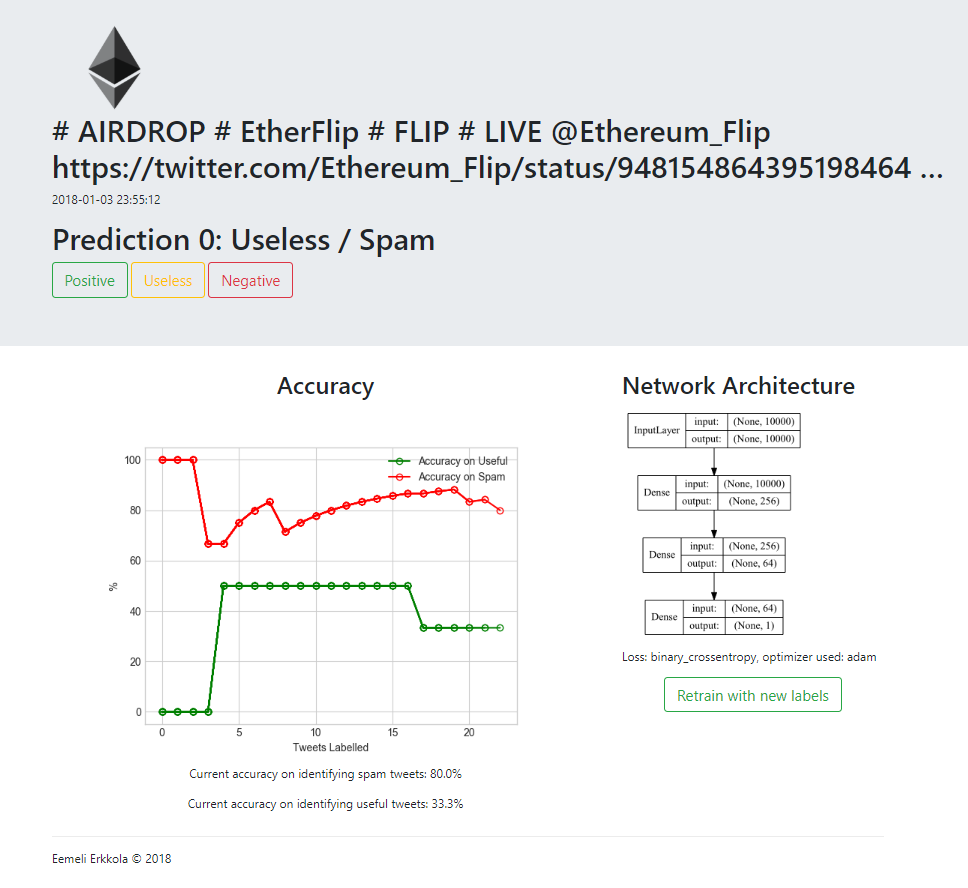

# Label and Learn: Ethereum

Label and Learn is a simple Flask front-end intended for labelling data with the ability to retrain the algorithm using the data on the go. For this demo I have used tweets about Ethereum, and have trained a simple neural net to identify spam and potentially useful tweets from large data-sets of tweets on Ethereum. The purpose of this is to collect meaningful data for future sentiment analysis that can be used to predict Ethereum price fluctuations.

The project uses the following libraries:
- pandas
- numpy
- keras
- tensorflow
- matplotlib

I have used hot-encoded vectors using the 10000 most frequently appearing words in the data set. This number can be changed around, however for larger values computation is longer. A simple neural net using dense layers and relu / sigmoid activations is used to predict a single output value of 0 or 1 for spam / potentially useful tweets. I've tokenised the words and done some pre-processing. With this setup I'm getting around 96% accuracy for detecting useless tweets, and around 60% for detecting useful tweets. While 60% is not a great accuracy, the most important function of this network is to filter out spam and maximise the probability of potentially useful tweets being passed on during the data collection phase. 

I've made the Flask front-end very simple. It serves as an easy way to label, see the predictions of the current classifier, and re-train when desired to update the predictions and see as the classifier improves over time. Currently I am only training one classifier for detecting useful / useless tweets, however as you can see from the labels I am categorising tweets with their sentiment, as the next step after training a useful tweet classifier would be to scrape as many non-spam tweets as possible and do sentiment analysis on the useful tweets.

Setting up a training set takes long as I had to label the data myself and this was a small side project I worked on outside of work. However I am still inspired to make a useful and efficient labelling and re-training front-end. While doing this project I realised the value there is in creating a front-end for labelling and training, as this can be used in larger projects to spread data labelling work to anyone, as the front-end is very easy to use and requires no actual knowledge of coding.

I will potentially build this into a larger more generalised labelling and learning tool, and might want to incorporate online learning with stochastic gradient descent, treating each tweet as a mini-batch and updating the weights live. For this purpose I would like to host future versions on AWS using elastic beanstalk to run this as an actual webapp. 

To run the web app, run the app.py as a python script, and open http://127.0.0.1:5000/ in your preferred web browser.

